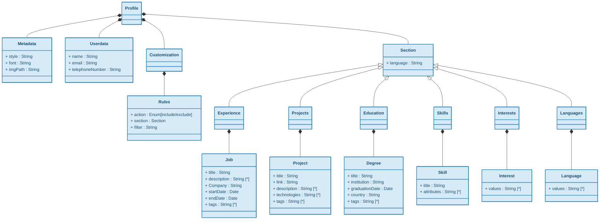

# Metamodel
## List
- Profile/CV
- Metadata
- Userdata
- Section
	- Experience
	- Projects
	- Skills
	- Interests
	- Languages
	- Job
	- Project
	- Skill
	- Interest
	- Language

## Diagram





## Possible DSL
```
Metadata
	style: "Academic"
	font: "Times New Roman"
	imgPath: "~/Documents/Images/ProfilePicture.jpg"
	
Userdata
	name: "Lucas Gonzalez"
	email: "lucasgonz@gmail.com"
	telephoneNumber: "+45 600000000"
	
Experience
	language: "EN"
	title: "Software Engineer"
		description: ["Implemented an internal tool for analyitics"]
		company: "Google"
		startDate: 02-2020
		endDate: 01-2022
		tags: [CLOUD, JAVA, DEVELOPER]
	
Experience
	language: "ES"
	title: "Ingeniero de Software"
		description: ["Implementé una herramienta interna para análisis"]
		company: "Google"
		startDate: 02-2020
		endDate: 01-2022
		tags: [CLOUD, JAVA, DESARROLLADOR]
	
Projects
	language: "EN"
	title: "REST API"
		description: ["Implemented a REST API for a shooping e-commerce", "Collaborate with experts"]
		technologies: ["Node.js", "Express"]
		link: "https://link.com"
		tags: ["WEB", "BACKEND"]
	title: "Pizza Web"
		description: ["Implemented a UI for a pizza restaurant", "Collaborate with experts"]
		technologies: ["Next.js", "React"]
		link: "https://link2.com"
		tags: ["WEB", "FRONTEND"]
Education
	language: "EN"
	title: "Master in Software Engineering"
	institution: "SDU"
	graduationDate: 2018
	country: "Denmark"
	tags: ["MASTER", "UNIVERSITY"]

Skills
	language: "EN"
	title: Frontend
		attributes: ["React", "HTML", "CSS", "Next.js"]
	title: Backend
		attributes: ["Node.js", "Python", "FastAPI", "Express.js"]
Interests
	language: "EN"
	values: ["Football", "Running", "Videogames", "Dancing"]
Languages
	language: "EN"
	values: ["English", "Spanish", "Italian"]
	
Customization
	include Profile where language EN
	exclude Education where filter
	include Projects where filter 
	exclude Skills
	
```	
